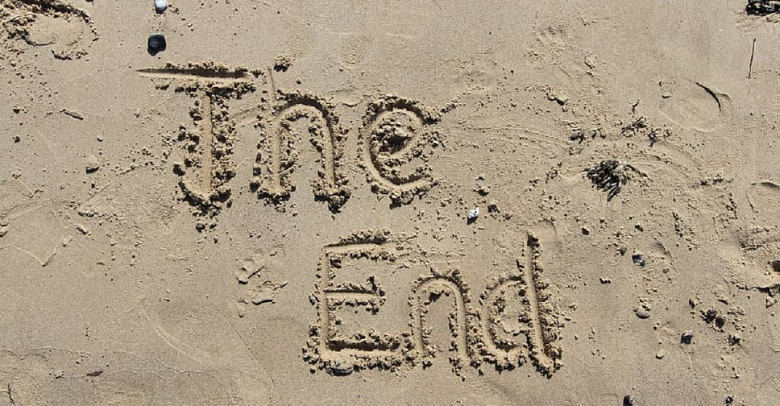

# Всем привет!

## Немного о себе

Меня зовут Александр. В свое время получил специальность "Инженер ДВС" в МГИУ (Московский государственный индустриальный университет - для тех кто не знает). 
На текущий момент хочу сменить профессию на IT. Записался на курс "Fullstack - разработчик  на Python" в Нетологию для освоения новой профессии связанной с IT сферой.  

# 

На этом пока ВСЕ